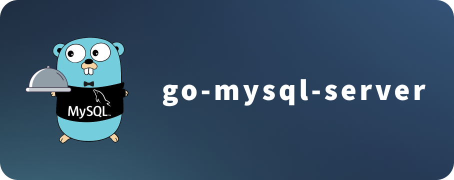
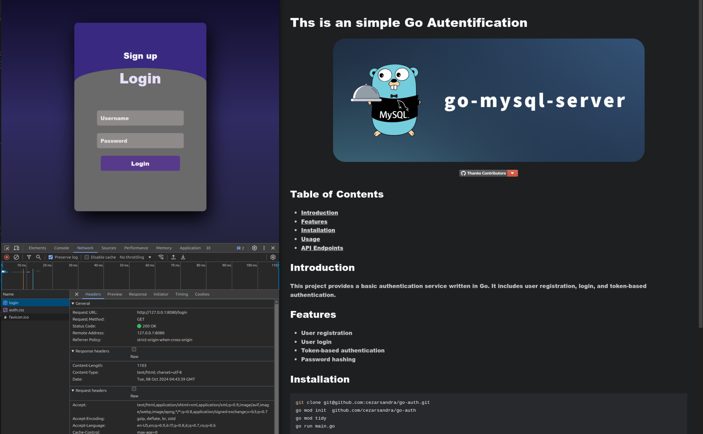

<!-- *README.md -->

# **Ths is an simple Go Autentification**

<p align="center"></p>
<p align="center"><a href="https://github.com/Stei-ITstudents/go-auth/api/graphs/contributors/"></a></p>

## Screenshots development

<p align="center"></p>

## Table of Contents

- [Introduction](#introduction)
- [Features](#features)
- [Installation](#installation)
- [Usage](#usage)
- [API Endpoints](#api-endpoints)

## Introduction

This project provides a basic authentication service written in Go. It includes user registration, login, and token-based authentication.

## Features

- User registration
- User login
- Token-based authentication
- Password hashing

## Installation

```sh
git clone git@github.com:Stei-ITstudents/go-auth.git
go mod init  github.com/Stei-ITstudents/go-auth
go mod tidy
go run main.go
```

## Usage

To use the authentication service, you can send HTTP requests to the provided endpoints. Below are some examples:

## Register a new user

```sh
 @curl -X POST http://localhost:8080/signup -d '{"username":"NewUser", "password":"password"}'
```

## **Development**

```sh
make
```

## **API Endpoints**

| Method | Endpoint | Description         |
| ------ | -------- | ------------------- |
| `POST` | /signup  | Register a new user |
| `POST` | /login   | Login a user        |
| `GET`  | /logout  | Logout a user       |
| `GET`  | /welcome | Welcome a user      |
